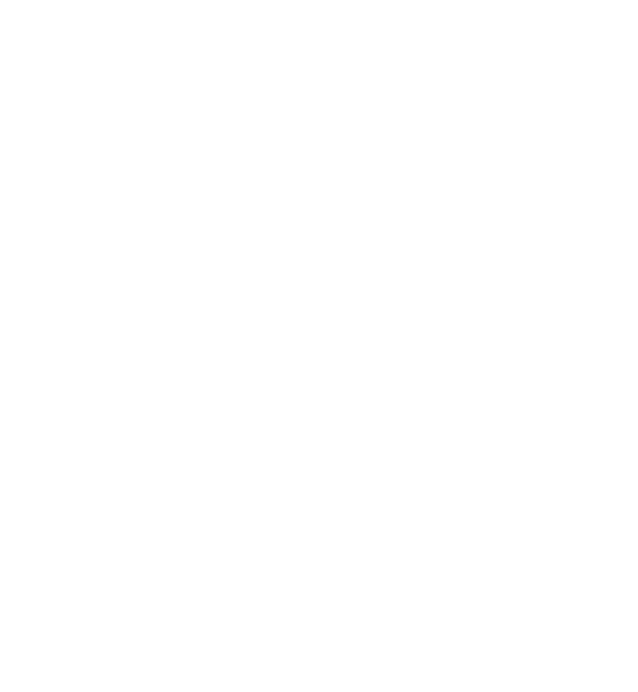

# House of Ravers | Production & Events



Sitio web oficial de **House of Ravers**, especialistas en iluminación, producción y gestión de eventos premium. Este proyecto utiliza tecnologías modernas para garantizar el máximo rendimiento, seguridad y facilidad de gestión.

## 🚀 Tecnologías Principales

- **[Astro v5](https://astro.build/)**: Framework web para la máxima velocidad (Static Site Generation).
- **[Tailwind CSS](https://tailwindcss.com/)**: Estilizado moderno con estética Neon/Dark.
- **[Keystatic CMS](https://keystatic.com/)**: Panel administrativo integrado para gestión de contenidos sin base de datos.
- **[Cloudflare R2](https://www.cloudflare.com/developer-platform/r2/)**: Almacenamiento de objetos para la gestión eficiente de imágenes y videos.
- **[Web3Forms](https://web3forms.com/)**: Servicio de envío de correos seguro para el formulario de contacto.

## 🛠️ Estructura del Proyecto

```text
/
├── src/
│   ├── components/      # Componentes UI (Header, Hero, Services, etc.)
│   ├── content/         # Archivos Markdown gestionados por el CMS
│   │   ├── services/    # Definición de servicios
│   │   └── portfolio/   # Proyectos (Eventos y Corporativos)
│   ├── pages/           # Rutas del sitio (Index, Portfolio)
│   └── middleware.ts    # Seguridad del panel administrativo
├── public/              # Archivos estáticos (favicon, videos)
├── keystatic.config.ts  # Configuración del CMS
└── astro.config.mjs     # Configuración principal de Astro
```

## ⚙️ Configuración (.env)

El proyecto requiere las siguientes variables de entorno para funcionar correctamente:

```env
# Formulario de Contacto
PUBLIC_WEB3FORMS_KEY=tu_clave_aqui

# Credenciales del Administrador (CMS)
ADMIN_USERNAME=admin
ADMIN_PASSWORD=tu_clave_segura

# Almacenamiento R2
PUBLIC_R2_URL=https://tu-bucket.houseofravers.cl
```

## 🖥️ Desarrollo Local

1. Instalar dependencias:
   ```bash
   npm install
   ```
2. Ejecutar servidor de desarrollo:
   ```bash
   npm run dev
   ```
3. Acceder al Administrador:
   Ve a `http://localhost:4321/keystatic` e ingresa tus credenciales del `.env`.

## 🖼️ Gestión de Assets (R2)

Para mantener el repositorio liviano, las imágenes de proyectos no se suben directamente al código:
1. Sube la imagen a tu bucket de **Cloudflare R2**.
2. Copia el **nombre del archivo** (ej: `evento-01.jpg`).
3. En el panel de Keystatic, pega ese nombre en el campo correspondiente.
4. El sitio construirá automáticamente la URL completa usando `PUBLIC_R2_URL`.

## 🔒 Seguridad

El panel `/keystatic` está protegido por un middleware de **Basic Auth**. Para producción en Cloudflare, se recomienda activar además **Cloudflare Access (Zero Trust)** para una capa extra de protección.

---
Generado por **Antigravity** (Google DeepMind)
